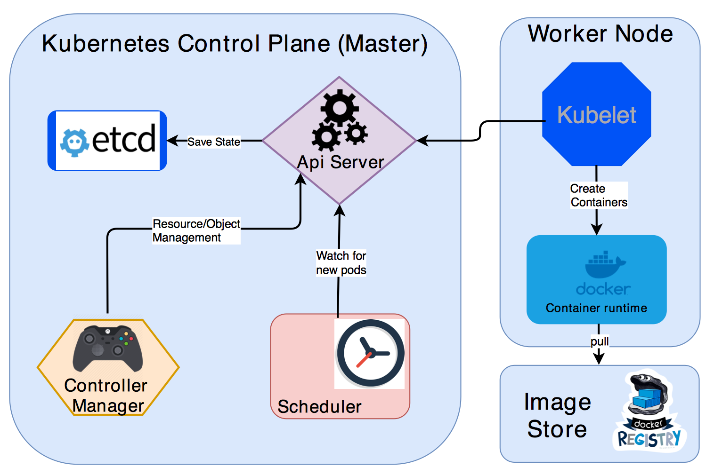

`.........................................................` [***`Table of Contents`***](README.md)

- `Desired State`: The state of cluster you want it to be. What applications or other workloads you want to run, the number of replicas, what network and disk resources you want to make available etc.
- `Kubernetes Control Plane`:  Makes the clusters current state match the desired state via Pod Lifecycle Event Generator([PLEG](https://github.com/kubernetes/community/blob/master/contributors/design-proposals/node/pod-lifecycle-event-generator.md))

- `k8s Master` (single node) - `kube-api server`, `kube-controller-manager` and `kube-scheduler`.
- `k8s non-master` node - `kubelet` (communicates with master), `kube-proxy` (manages network proxy on each node).

**Basic Kubernetes objects**:
- Pod
- Service
- Volume
- Namespace

`Other higher level abstraction that rely on controllers:`
- Deployment
- DaemonSet
- StatefulSet
- ReplicaSet
- Job

