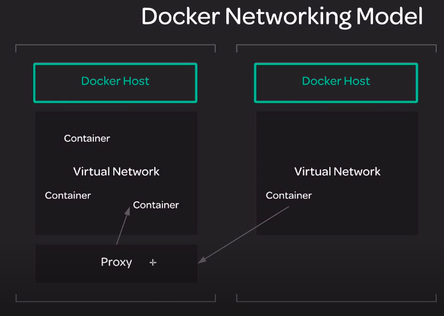
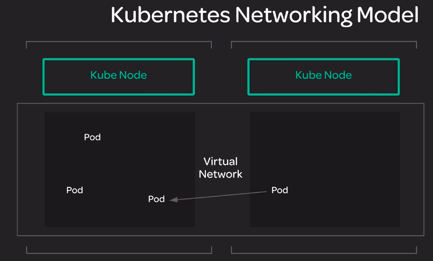

##### Back to [Index](README.md)

---

##### The Kubernetes Networking Model

- Docker allows containers to communicate with one another using a virtual network bridge configured on the host.

- Each host has its own virtual network serving all of the containers on that host.

- But what about containers on different hosts? We have to proxy traffic from one host to the containers, making sure no two containers use the same port on a host.

- The kubernetes networking model was created in response to the Docker model. It was designed to improve on some of the limitations of the Docker Model.

- Container on right side communicates with containers on left side using a separate proxy connection serving on a unique port.
- 

---

- The Kubernetes Networking Model

- One virtual network for the whole cluster.
- Each pod has a unique IP within the cluster.
- Each service has a unique IP that is in a different range than pod IPs. 

- 
- [ref](https://kubernetes.io/docs/concepts/cluster-administration/networking/)