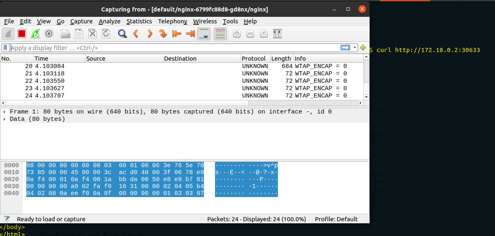

##### Capturing Packets within running Pod 


1. Installing ksniff plugin

a. Installing wireshark
```bash
$ sudo apt update -y
$ sudo apt install wireshark -y
$ sudo usermod -aG wireshark $USER
$ sudo dpkg-reconfigure wireshark-common
$ sudo chmod +x /usr/bin/dumpcap

```

b. Installing krew
```bash
$ (
  set -x; cd "$(mktemp -d)" &&
  OS="$(uname | tr '[:upper:]' '[:lower:]')" &&
  ARCH="$(uname -m | sed -e 's/x86_64/amd64/' -e 's/\(arm\)\(64\)\?.*/\1\2/' -e 's/aarch64$/arm64/')" &&
  curl -fsSLO "https://github.com/kubernetes-sigs/krew/releases/latest/download/krew.tar.gz" &&
  tar zxvf krew.tar.gz &&
  KREW=./krew-"${OS}_${ARCH}" &&
  "$KREW" install krew
)

$ export PATH=$PATH:~/.krew/bin

$ bash

``` 

c. Using sniff to capture tcmpdump and view it on wireshark
```bash
$ mkdir /tmp/static-tcpdump

$ kubectl create deployment nginx --image=nginx
  deployment.apps/nginx created

$ kubectl get po
NAME                     READY   STATUS    RESTARTS   AGE
nginx-6799fc88d8-gd8nx   1/1     Running   0          2m45s

$ kubectl expose deployment nginx --port=80 --target-port=80 --type='NodePort' 
service/nginx exposed

$ kubectl get svc -o wide
NAME         TYPE        CLUSTER-IP      EXTERNAL-IP   PORT(S)        AGE   SELECTOR
nginx        NodePort    10.103.23.159   <none>        80:30633/TCP   4s    app=nginx

$ kubectl get no -o wide
NAME                 STATUS   ROLES    AGE     VERSION   INTERNAL-IP   EXTERNAL-IP   OS-IMAGE                                     KERNEL-VERSION     CONTAINER-RUNTIME
kind-control-plane   Ready    master   2d23h   v1.19.1   172.18.0.2    <none>        Ubuntu Groovy Gorilla (development branch)   5.4.0-73-generic   containerd://1.4.0

$ curl http://172.18.0.2:30633
```

This will start capturing network traffic and pops up wireshark window to display live packet flow
```bash
$ kubectl sniff -p nginx-6799fc88d8-gd8nx -n default -f "port 80"
```


We can dump the tcpdump data into a pcap file and later view it using wireshark
```bash
$ kubectl sniff -p nginx-6799fc88d8-gd8nx -n default -f "port 80" -o /tmp/myexample-k8s.pcap
```

- Note: 
- If there are more than one containers running inside the pod, you can pass the container's name using `-c container_name` of which you're interested to capture the traffic.


---
Ref:

- ksniff: https://github.com/eldadru/ksniff
- Installing krew: https://krew.sigs.k8s.io/docs/user-guide/setup/install/
- Installing wireshark on ubuntu: https://linuxhint.com/install_configure_wireshark_ubuntu/
- ksniff blog: https://kubesandclouds.com/index.php/2021/01/20/ksniff/
