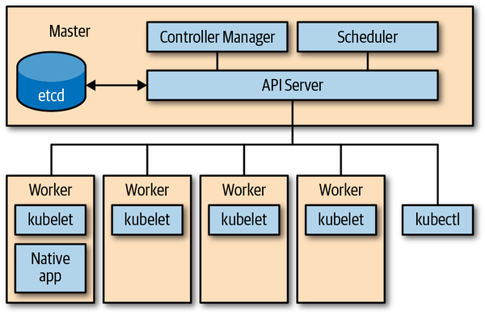
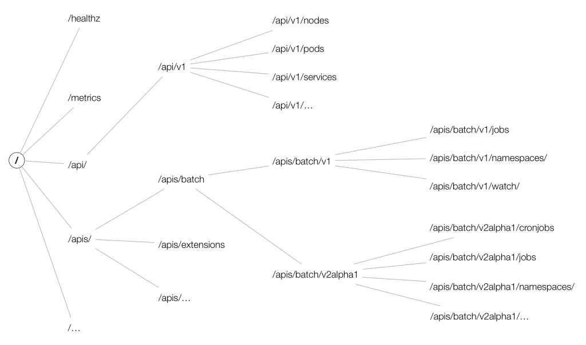

`......................................................... GoTo` [***`Index`***](../README.md)

**Kubernetes API Basics**

- Using API server we can proxy cluster components, such as the kubernetes dashboard, or to stream logs, service port, or serve `kubectl exec` sessions.

- Serving API means:
  - `Reading state`: getting single objects, listing them, and streaming changes.
  - `Manipulating state`: creating, updating and deleting objects.
  - State is persisted in `etcd`
  
  
  
- API Reference - [k8s API endpoints](https://kubernetes.io/docs/reference/generated/kubernetes-api/v1.17/)

- API Terminology
  - `Kind`: has three categories:
    - `Objects`: Represents a persistent entity in the system.
      - example: Pod, Endpoints etc. 
      - Objects have name and many of them live in a namespaces.
  
    - `Lists` - are collection of one or more `kinds` of entities.
      - Lists have limited set of common metadata. 
      - Examples: PodLists or NodeLists.
      - `kubectl get pods` returns PodLists
    
    - `Special purpose kinds` - are used for specific actions on objects and for nonpersistent entities such as `/binding` or `/scale`.
      - For discovery Kubernetes uses `APIGroup` and `APIResource`; for error results; it uses `Status`.
      
  - In k8s programs, a `kind` directly corresponds with Golang type. 
    - Thus, as Golang types, kinds are singular and being with a capital letter.
    - Example: Deployment kind 
      ```bash
      $ kubectl api-resources | grep -i deployment
      deployments                       deploy       apps                           true         Deployment
      ```
      Golang type [definition](https://github.com/kubernetes/api/blob/master/apps/v1/types.go#L254):      
      ```go
      type Deployment struct {
        metav1.TypeMeta `json:",inline"`
        // Standard object metadata.
        // +optional
        metav1.ObjectMeta `json:"metadata,omitempty" protobuf:"bytes,1,opt,name=metadata"`
      
        // Specification of the desired behavior of the Deployment.
        // +optional
        Spec DeploymentSpec `json:"spec,omitempty" protobuf:"bytes,2,opt,name=spec"`
      
        // Most recently observed status of the Deployment.
        // +optional
        Status DeploymentStatus `json:"status,omitempty" protobuf:"bytes,3,opt,name=status"`
      }
      ```     
      
  - API Group: A collection of Kinds that are logically related. 
    - Example: batch objects such as `Job`, `JobSpec` , `JobList` etc are in [`batch`](https://github.com/kubernetes/api/tree/master/batch) API group. 
    
  - Version: 
    - Each API group can exist in multiple versions.
      - For e.g, a group first appears as `v1alpha1` and is the promoted to `v1beta1` and finally graduates to `v1`.
      - An object created in one version(e.g. v1beta1) can be retrieved in each of the supported versions. 
      - The API server does lossless conversion to return objects in the requested version.
      - From the cluster user's point of view, versions are just different representations of the same objects.
      - There is no such thing as `one object is in v1` in the cluster and another object is in `v1beta1` in the cluster.
        - Instead, every object can be returned as a v1 representation or in the v1beta1 representation, as the cluster user desires.
        
  - Resource:
    - A usually lowercase, plural word (e.g., pods) identifying a set of HTTP endpoints (paths) exposing the `CRUD` semantics of a certain object type in the system.
    - Common paths are:
      - The root, such as `.../pods`, which lists all instance of that type.
      - A path for individual named resources, such as `.../pods/nginx`.
      - Typically, each of these endpoints returns and receives one kind(a `PodList` in the first cae, and `Pod` in the second.)
      - But in other situations(e.g., in case of errors), a `Status` kind object is returned.
    
    - In addition to the main resource with full `CRUD` semantics, a resource can have further endpoints to perform specific actions(e.g., .../pod/nginx/port-fordward, .../pod/nfinx/exec, or .../pod/nginx/logs).  These are called [`sub-resources`](../../k8s_api/k8s_api_conventions/README.md)
      - Subresources - are special HTTP endpoints, using a suffix appended to the HTTP path of the normal resource.
        - e.g., the pod standard HTTP path is `/api/v1/namespace/<namespace>/pods/<name>`.
        - Pods have a number of subresources, such as `/logs, /portforward, /exec, and /status`.
        - The corresponding subresources HTTP paths are:
          - `/api/v1/namespace/<namespace>/pods/<name>/logs`   
          - `/api/v1/namespace/<namespace>/pods/<name>/portforward`   
          - `/api/v1/namespace/<namespace>/pods/<name>/exec`   
          - `/api/v1/namespace/<namespace>/pods/<name>/status`   
      - These subresources usually implement custom protocols instead of REST, for e.g., some kind of streaming connection via WebSockets or imperative APIs.          
      
  
  - Note:
    - Resources correspond to HTTP paths.
    - Kinds are the types of objects returned by and received by these endpoints, as well as persisted in `etcd`.
    
  - Resources are always part of an API group and a version, collectively referred as `GroupVersionResource` (GVR).
  - A GVR uniquely defines an HTTP path.
  - A concrete path, for example, in the `default` namespace would be `/apis/batch/v1/namespaces/default/jobs`.
       
    
  - Resources which are not part of namespace doesn't have `$NAMESPACE` in their path.
    - e.g., Node GVR might look like `/api/v1/nodes/`, or `/api/v1/namespaces`
  
  - API groups:
    - The core group, often referred to as the `legacy group`, is at the REST path `/api/v1` and uses `apiVersion: v1`. [`ref`](https://github.com/kubernetes/api/tree/master/core/v1)
      - Note: The core group is located under `/api/v1` and not, as one would be expect, under `/apis/core/v1`, for historic reasons.
      - The core group existed before the concept of an API group was introduced.
    - The named groups are at REST path `/apis/$GROUP_NAME/$VERSION`, and use `apiVersion: $GROUP_NAME/$VERSION` (e.g, apiVersion: batch/v1)
    
  - Similarly to GVRs, each kind lives in an API group, is versioned, and is identified via a `GroupVersionKind` (GVK).
  
  - COHABITATION: Kinds of same name may coexist not only in different versions, but also in different API groups, simultaneously.
  - e.g., `Deployment` started as an alpha kind in the extensions group and was eventually promoted to a stable version in its own group, `apps.k8s.io` . This is know as `Cohabitation`.
    - Ingress, NetworkPolicy in extensions and networking.k8s.io.
    - Deployment, DaemonSet, ReplicaSet in extensions and apps.
    - Event in the core group and events.k8s.io.
    
  
  - GVKs are served under HTTP paths identified by GVRs.
  - The process of mapping a GVK to a GVR is called REST mapping.[ref](https://github.com/kubernetes/apimachinery/blob/master/pkg/api/meta/interfaces.go#L113)
  
  
  - From a global point of view, the API resource space logically forms a tree with top-level nodes including `/api`, `/apis`, and some nonhierarchical endpoints such as `/healthz` or `/metrics`. 
  
  
  
  - **Kubernetes API Versioning**
    - For extensibility reasons, kubernetes supports multiple API versions at different API paths, such as `/api/v1`, or `/apis/extensions/v1beta1`.
    - Different API versions imply different levels of stability and support:
      - **Alpha level** - (e.g., v1alpha1) is usually disabled by default, support for a feature may be dropped at any time without notice and should be used only in short-lived testing clusters.
      - **Beta level** - (e.g., v2beta3) is enabled be default, meaning that the code is well tested; however, the semantics(if Syntax is structure. then Semantics is meaning) of objects may change in incompatible ways in a subsequent beta or stable release.
      - **Stable (generally available, or GA) level** - (e.g., v1) will appear in released software for many subsequent versions.
      
      
  - There is a third type of HTTP paths- once that are not resource aligned- that API server exposes: cluster-wide entities such as `/metrics`, `/logs`, or `/healthz`.
  - In addition, the API server supports watches; that is rather than polling resources at set interval, you can add a `?watch=true` to certain requests and the API server changes into a [`watch modus`](https://kubernetes.io/docs/reference/using-api/api-concepts/#efficient-detection-of-changes)     
  
  
  - **Declarative State Management** - 
    - A `specification` or `spec`, is a complete description of desired state of a resource and is typically persisted in stable storage, such as `etcd`.
    
- ##### Using the API from the Command Line
  - This command proxies kubernetes API to our local machine and also takes care of the authentication and authorization bits.  
    ```bash
    $ kubectl proxy --port=8080
    Starting to serve on 127.0.0.1:8080
    ```    
  - It allows to directly issue requests via HTTP and receive JSON payloads in return.
  - `/apis/batch/v1`
  ```bash
  $ curl http://127.0.0.1:8080/apis/batch/v1
  {
    "kind": "APIResourceList",
    "apiVersion": "v1",
    "groupVersion": "batch/v1",
    "resources": [
      {
        "name": "jobs",
        "singularName": "",
        "namespaced": true,
        "kind": "Job",
        "verbs": [
          "create",
          "delete",
          "deletecollection",
          "get",
          "list",
          "patch",
          "update",
          "watch"
        ],
        "categories": [
          "all"
        ],
        "storageVersionHash": "mudhfqk/qZY="
      },
      {
        "name": "jobs/status",
        "singularName": "",
        "namespaced": true,
        "kind": "Job",
        "verbs": [
          "get",
          "patch",
          "update"
        ]
      }
    ]
  }
  ```  
  
  - `/apis/batch/v1beta1`
  ```bash
  $ curl http://127.0.0.1:8080/apis/batch/v1beta1
  {
    "kind": "APIResourceList",
    "apiVersion": "v1",
    "groupVersion": "batch/v1beta1",
    "resources": [
      {
        "name": "cronjobs",
        "singularName": "",
        "namespaced": true,
        "kind": "CronJob",
        "verbs": [
          "create",
          "delete",
          "deletecollection",
          "get",
          "list",
          "patch",
          "update",
          "watch"
        ],
        "shortNames": [
          "cj"
        ],
        "categories": [
          "all"
        ],
        "storageVersionHash": "h/JlFAZkyyY="
      },
      {
        "name": "cronjobs/status",
        "singularName": "",
        "namespaced": true,
        "kind": "CronJob",
        "verbs": [
          "get",
          "patch",
          "update"
        ]
      }
    ]
  }
  ```
  
  - As we can see, the `v1beta1` version also contains the `cronjobs` resource with kind `CronJob`. At this version of k8, the `cron jobs` have not been promoted to `v1`.
  - Note: We can get HTTP API access to K8s API using `kubectl get --raw /apis/batch/v1`
  

- ##### How the API Server Processes Requests
  
  Figure: Kubernetes API server request processing overview.
  
  Following interactions take place when an HTTP request hits the Kubernetes API:
  
  1. The HTTP request is processed by a chain of filters registered in [`DefaultBuildHandlerChain(config.go)`](https://github.com/kubernetes/apiserver/blob/master/pkg/server/config.go#L658)
    - It applies a series of filter operations on said request.
    - Either the filter passes and attaches respective information to the context- `ctx.RequestInfo`.
    - If a request does not pass a filter, it returns an appropriate HTTP response code stating the reason(e.g., 401, user authentication failed.)
  
  2. Next, depending on the HTTP path, the multiplexer in [handler.go](https://github.com/kubernetes/apiserver/blob/master/pkg/server/handler.go#L42), routes the HTTP request to the respective handler.
  
  3. A handler is registered for each API group([groupversion.go](https://github.com/kubernetes/apiserver/blob/master/pkg/endpoints/groupversion.go#L97), [installer.go](https://github.com/kubernetes/apiserver/blob/master/pkg/endpoints/installer.go#L181) for details).
    - It takes the HTTP request as well as the context (for e.g., user and access rights) and retrieves as well delivers the requested object from `etcd` storage.
    
  - Deep dive in chain of filters `DefaultBuildHandlerChain`:
    ```go
    func DefaultBuildHandlerChain(apiHandler http.Handler, c *Config) http.Handler {
    	handler := genericapifilters.WithAuthorization(apiHandler, c.Authorization.Authorizer, c.Serializer)
    	if c.FlowControl != nil {
    		handler = genericfilters.WithPriorityAndFairness(handler, c.LongRunningFunc, c.FlowControl)
    	} else {
    		handler = genericfilters.WithMaxInFlightLimit(handler, c.MaxRequestsInFlight, c.MaxMutatingRequestsInFlight, c.LongRunningFunc)
    	}
    	handler = genericapifilters.WithImpersonation(handler, c.Authorization.Authorizer, c.Serializer)
    	handler = genericapifilters.WithAudit(handler, c.AuditBackend, c.AuditPolicyChecker, c.LongRunningFunc)
    	failedHandler := genericapifilters.Unauthorized(c.Serializer, c.Authentication.SupportsBasicAuth)
    	failedHandler = genericapifilters.WithFailedAuthenticationAudit(failedHandler, c.AuditBackend, c.AuditPolicyChecker)
    	handler = genericapifilters.WithAuthentication(handler, c.Authentication.Authenticator, failedHandler, c.Authentication.APIAudiences)
    	handler = genericfilters.WithCORS(handler, c.CorsAllowedOriginList, nil, nil, nil, "true")
    	handler = genericfilters.WithTimeoutForNonLongRunningRequests(handler, c.LongRunningFunc, c.RequestTimeout)
    	handler = genericfilters.WithWaitGroup(handler, c.LongRunningFunc, c.HandlerChainWaitGroup)
    	handler = genericapifilters.WithRequestInfo(handler, c.RequestInfoResolver)
    	handler = genericfilters.WithPanicRecovery(handler)
    	return handler
    }
    ```
    
    - [`WithPanicRecovery`](https://github.com/kubernetes/apiserver/blob/master/pkg/server/filters/wrap.go#L29): Takes care of recovery and log panics.
    - [`WithRequestInfo`](https://github.com/kubernetes/apiserver/blob/master/pkg/endpoints/filters/requestinfo.go#L28): Attaches a [RequestInfo](https://github.com/kubernetes/apiserver/blob/master/pkg/endpoints/request/requestinfo.go#L42) to the context. 
    - [`WithWaitGroup`](https://github.com/kubernetes/apiserver/blob/master/pkg/server/filters/waitgroup.go#L34): Adds all non-long-running requests to wait group; used for graceful shutdown.`
    - [`WithTimeoutForNonLongRunningRequests`](https://github.com/kubernetes/apiserver/blob/master/pkg/server/filters/timeout.go#L39): Times out non-long-running requests(like most GET, PUT, POST, and DELETE requests), in contrast to long-running requests such as watches and proxy requests.
    - [`WithCORS`](https://github.com/kubernetes/apiserver/blob/master/pkg/server/filters/cors.go#L36): Provides a CORS implementation. 
      - CORS, short for cross-origin resource sharing, is mechanism that allows JavaScript embedded in an HTML page to make XMLHttpRequests to a domain different from the one that the JavaScript originated in.
    - [`WithAuthentication`](https://github.com/kubernetes/apiserver/blob/master/pkg/endpoints/filters/authentication.go#L90): Attempts to authenticate the given request as a human or machine user and stores the user info in the provided context. 
      - On success, the Authorization HTTP header is removed from the request. If the authentication fails, it returns an HTTP 401 status code.
    - [`WithAudit`](https://github.com/kubernetes/apiserver/blob/master/pkg/endpoints/filters/audit.go#L41): Decorates the handler with audit logging information for all incoming requests.
      - The audit log entries contain information such as the source IP of the request, user invoking the operation, and namespace of the request.
    - [`WithImpersonation`](https://github.com/kubernetes/apiserver/blob/master/pkg/endpoints/filters/impersonation.go#L41): Handles user impersonation by checking requests that attempt to change the user(similar to sudo).
      - Is a filter that will inspect and check requests that attempt to change the user.Info for their requests
    - [`WithMaxInFlightLimit`](https://github.com/kubernetes/apiserver/blob/master/pkg/server/filters/maxinflight.go#L97): Limits the number of in-flight requests.
    - [`WithAuthorization`](https://github.com/kubernetes/apiserver/blob/master/pkg/endpoints/filters/authorization.go#L45): Checks permissions by invoking authorization modules and passes all authorized requests to a multiplexer, which dispatches the request to the right handler.
      - If the user doesn't have sufficient rights, it returns an HTTP 403 status code. 
      - K8s uses role-based access control(RBAC).
    
  - After this generic handler chain is passed, the actual request processing starts.
  
  - Requests for `/`, `/version`, `/apis`, `/healthz`, and other nonRESTful APIs are directly handled.
  - Requests for RESTful resources go into the requests pipeline consisting of:
    - Incoming objects go through an admission chain.