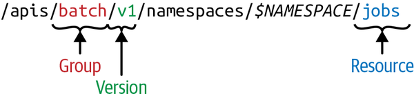

`......................................................... GoTo` [***`Index`***](../README.md)

**Kubernetes API Basics**

- Using API server we can proxy cluster components, such as the kubernetes dashboard, or to stream logs, service port, or serve `kubectl exec` sessions.

- Serving API means:
  - `Reading state`: getting single objects, listing them, and streaming changes.
  - `Manipulating state`: creating, updating and deleting objects.
  - State is persisted in `etcd`
  
  
  
- API Reference - [k8s API endpoints](https://kubernetes.io/docs/reference/generated/kubernetes-api/v1.17/)

- API Terminology
  - `Kind`: has three categories:
    - `Objects`: Represents a persistent entity in the system.
      - example: Pod, Endpoints etc. 
      - Objects have name and many of them live in a namespaces.
  
    - `Lists` - are collection of one or more `kinds` of entities.
      - Lists have limited set of common metadata. 
      - Examples: PodLists or NodeLists.
      - `kubectl get pods` returns PodLists
    
    - `Special purpose kinds` - are used for specific actions on objects and for nonpersistent entities such as `/binding` or `/scale`.
      - For discovery Kubernetes uses `APIGroup` and `APIResource`; for error results; it uses `Status`.
      
  - In k8s programs, a `kind` directly corresponds with Golang type. 
    - Thus, as Golang types, kinds are singular and being with a capital letter.
    - Example: Deployment kind 
      ```bash
      $ kubectl api-resources | grep -i deployment
      deployments                       deploy       apps                           true         Deployment
      ```
      Golang type [definition](https://github.com/kubernetes/api/blob/master/apps/v1/types.go#L254):      
      ```go
      type Deployment struct {
        metav1.TypeMeta `json:",inline"`
        // Standard object metadata.
        // +optional
        metav1.ObjectMeta `json:"metadata,omitempty" protobuf:"bytes,1,opt,name=metadata"`
      
        // Specification of the desired behavior of the Deployment.
        // +optional
        Spec DeploymentSpec `json:"spec,omitempty" protobuf:"bytes,2,opt,name=spec"`
      
        // Most recently observed status of the Deployment.
        // +optional
        Status DeploymentStatus `json:"status,omitempty" protobuf:"bytes,3,opt,name=status"`
      }
      ```     
      
  - API Group: A collection of Kinds that are logically related. 
    - Example: batch objects such as `Job`, `JobSpec` , `JobList` etc are in [`batch`](https://github.com/kubernetes/api/tree/master/batch) API group. 
    
  - Version: 
    - Each API group can exist in multiple versions.
      - For e.g, a group first appears as `v1alpha1` and is the promoted to `v1beta1` and finally graduates to `v1`.
      - An object created in one version(e.g. v1beta1) can be retrieved in each of the supported versions. 
      - The API server does lossless conversion to return objects in the requested version.
      - From the cluster user's point of view, versions are just different representations of the same objects.
      - There is no such thing as `one object is in v1` in the cluster and another object is in `v1beta1` in the cluster.
        - Instead, every object can be returned as a v1 representation or in the v1beta1 representation, as the cluster user desires.
        
  - Resource:
    - A usually lowercase, plural word (e.g., pods) identifying a set of HTTP endpoints (paths) exposing the `CRUD` semantics of a certain object type in the system.
    - Common paths are:
      - The root, such as `.../pods`, which lists all instance of that type.
      - A path for individual named resources, such as `.../pods/nginx`.
      - Typically, each of these endpoints returns and receives one kind(a `PodList` in the first cae, and `Pod` in the second.)
      - But in other situations(e.g., in case of errors), a `Status` kind object is returned.
    
    - In addition to the main resource with full `CRUD` semantics, a resource can have further endpoints to perform specific actions(e.g., .../pod/nginx/port-fordward, .../pod/nfinx/exec, or .../pod/nginx/logs).  These are called [`sub-resources`](../../k8s_api/k8s_api_conventions/README.md)
      - Subresources - are special HTTP endpoints, using a suffix appended to the HTTP path of the normal resource.
        - e.g., the pod standard HTTP path is `/api/v1/namespace/<namespace>/pods/<name>`.
        - Pods have a number of subresources, such as `/logs, /portforward, /exec, and /status`.
        - The corresponding subresources HTTP paths are:
          - `/api/v1/namespace/<namespace>/pods/<name>/logs`   
          - `/api/v1/namespace/<namespace>/pods/<name>/portforward`   
          - `/api/v1/namespace/<namespace>/pods/<name>/exec`   
          - `/api/v1/namespace/<namespace>/pods/<name>/status`   
      - These subresources usually implement custom protocols instead of REST, for e.g., some kind of streaming connection via WebSockets or imperative APIs.          
      
  
  - Note:
    - Resources correspond to HTTP paths.
    - Kinds are the types of objects returned by and received by these endpoints, as well as persisted in `etcd`.
    
  - Resources are always part of an API group and a version, collectively referred as `GroupVersionResource` (GVR).
  - A GVR uniquely defines an HTTP path.
  - A concrete path, for example, in the `default` namespace would be `/apis/batch/v1/namespaces/default/jobs`.
       
    
  - Resources which are not part of namespace doesn't have `$NAMESPACE` in their path.
    - e.g., Node GVR might look like `/api/v1/nodes/`, or `/api/v1/namespaces`
  
  - API groups:
    - The core group, often referred to as the `legacy group`, is at the REST path `/api/v1` and uses `apiVersion: v1`. [`ref`](https://github.com/kubernetes/api/tree/master/core/v1)
      - Note: The core group is located under `/api/v1` and not, as one would be expect, under `/apis/core/v1`, for historic reasons.
      - The core group existed before the concept of an API group was introduced.
    - The named groups are at REST path `/apis/$GROUP_NAME/$VERSION`, and use `apiVersion: $GROUP_NAME/$VERSION` (e.g, apiVersion: batch/v1)
    
  - Similarly to GVRs, each kind lives in an API group, is versioned, and is identified via a `GroupVersionKind` (GVK).
  
  - COHABITATION: Kinds of same name may coexist not only in different versions, but also in different API groups, simultaneously.
  - e.g., `Deployment` started as an alpha kind in the extensions group and was eventually promoted to a stable version in its own group, `apps.k8s.io` . This is know as `Cohabitation`.
    - Ingress, NetworkPolicy in extensions and networking.k8s.io.
    - Deployment, DaemonSet, ReplicaSet in extensions and apps.
    - Event in the core group and events.k8s.io.
    
  
  - GVKs are served under HTTP paths identified by GVRs.
  - The process of mapping a GVK to a GVR is called REST mapping.[ref](https://github.com/kubernetes/apimachinery/blob/master/pkg/api/meta/interfaces.go#L113)
  
  
  - From a global point of view, the API resource space logically forms a tree with top-level nodes including `/api`, `/apis`, and some nonhierarchical endpoints such as `/healthz` or `/metrics`. 
  
  
  
  - **Kubernetes API Versioning**
    - For extensibility reasons, kubernetes supports multiple API versions at different API paths, such as `/api/v1`, or `/apis/extensions/v1beta1`.
    - Different API versions imply different levels of stability and support:
      - **Alpha level** - (e.g., v1alpha1) is usually disabled by default, support for a feature may be dropped at any time without notice and should be used only in short-lived testing clusters.
      - **Beta level** - (e.g., v2beta3) is enabled be default, meaning that the code is well tested; however, the semantics(if Syntax is structure. then Semantics is meaning) of objects may change in incompatible ways in a subsequent beta or stable release.
      - **Stable (generally available, or GA) level** - (e.g., v1) will appear in released software for many subsequent versions.
      
      
  - There is a third type of HTTP paths- once that are not resource aligned- that API server exposes: cluster-wide entities such as `/metrics`, `/logs`, or `/healthz`.
  - In addition, the API server supports watches; that is rather than polling resources at set interval, you can add a `?watch=true` to certain requests and the API server changes into a [`watch modus`](https://kubernetes.io/docs/reference/using-api/api-concepts/#efficient-detection-of-changes)     
  
  
  - **Declarative State Management** - 
    - A `specification` or `spec`,    