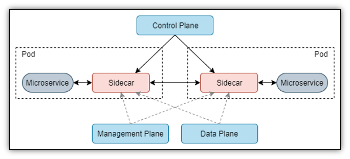

#### Service Mesh
- Manages service-to-service communication
- Layer 5 through layer 1 of the OSI network stack
- East west network traffic: In a networking context, is the transfer of data packets from server to server within a data center.

- Use cases:
  - Improve observability of distributed services
  - Blue/Green deployments (https://www.redhat.com/en/topics/devops/what-is-blue-green-deployment)
  - Modernizing legacy applications
  - A/B testing
  - Security (Network policy between applications etc)

- Common deployment pattern:
  - Blue-Green deployment: Reduce downtime during deployment between two environments. 
  - Canary Releases: Deploy to subset and verify before continuing rollout
  - A/B testing: Split traffic between two versions to compare performance
- ref: https://github.com/rahulrai-in/fast-track-istio

- Popular Service Mesh
  - Linkerd (doesn't support multiple clusters)
  - Istio
  - Consul
  - OSM - Microsoft

--- 

- North-south network traffic: North-south traffic is the movement of data packets that are initially entering a network from the outside.
- Jaeger, envoy, Zipkin